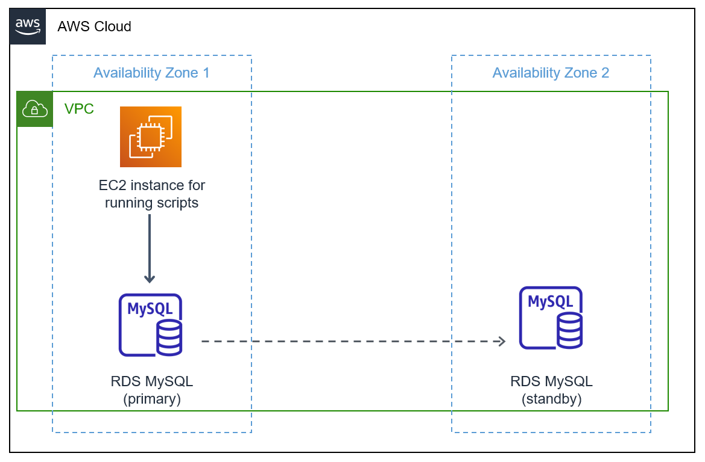

These scripts help you to measure and log failover or reboot times for an Amazon
RDS MySQL or Amazon Aurora MySQL instance. These are Windows batch scripts and
you will need a Windows machine to run them. This batch script uses the ‘mysql’
command line utility to connect to the database periodically, execute a query,
and log the response to a text file.

**Prerequisites**

-   A Windows instance to run the batch scripts

-   The ‘mysql’ command line utility must be installed on the Windows instance

-   An Amazon RDS MySQL or Amazon Aurora MySQL database instance

**Script details and configuration**

-   MYSQLPingRDS.bat – This batch file contains the script to execute the
    ‘mysql’ command line utility. You need to replace the following place
    holders in the batch file with actual values

    -   *"\<replace-with-path-to-mysql-install-dir\>*\\mysql" - Placeholder for
        the directory where the ‘mysql’ command line utility is installed. E.g.
        “C:\\Users\\Administrator\\Downloads\\mysql-8.0.27-winx64\\bin”

    -   *\<replace-with-the-database-endpoint\>* - The Amazon RDS or Amazon
        Aurora database endpoint

    -   *\<replace-with-the-database-user\>* - The database username. E.g. admin

    -   *\<replace-with-the-database-name\>* - The name of the database to
        connect to

-   MYSQLDefaults.txt – This is the ‘defaults-extra-file’ file used by the
    ‘mysql’ utility. This contains the database password, you can edit this file
    and replace the placeholder *‘\<replace-with-the-database-password\>*’ with
    the database password.

-   MYSQLQuery.txt – This file contains the query to execute against the
    database. The default query fetches the current time, database version, and
    database server address from the database, you can replace or customize the
    query according to your needs.

-   MYSQLlog.txt – The output or the results of the query executed are logged to
    this file.

**Sample Output**

The following is a sample output from the log file (‘MYSQLlog.txt’) during the
failover of an Amazon RDS for MySQL database instance. Each line corresponds to
one execution of the query that fetches the current time from the database. You
can see a brief interruption (57 seconds in this example) during the failover as
highlighted.

