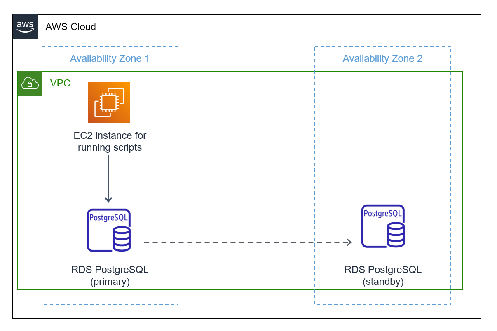
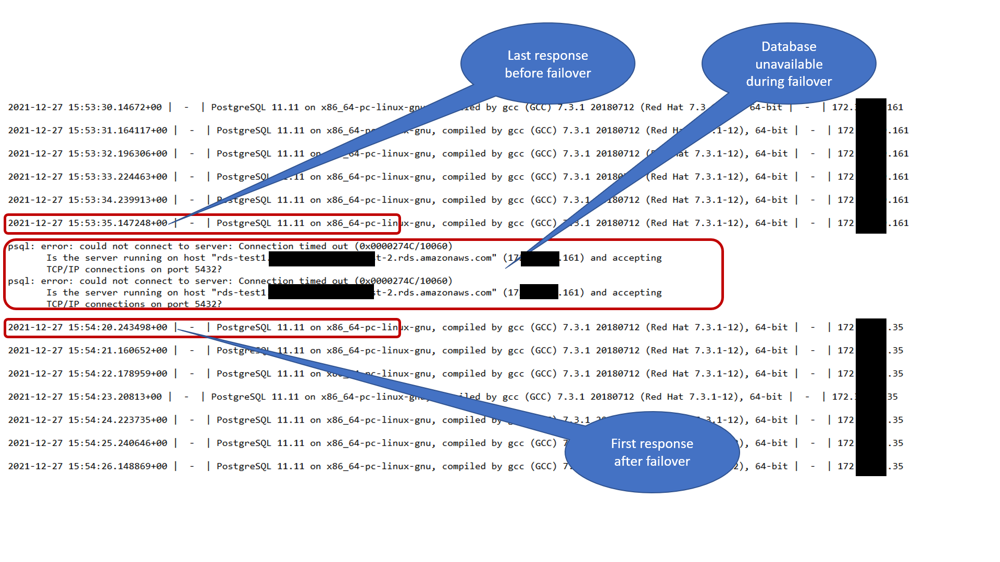

## Measuring DB failover time for Amazon RDS for PostgreSQL

These scripts help you to measure and log failover or reboot times for an Amazon
RDS PostgreSQL or Amazon Aurora PostgreSQL instance. These are Windows batch
scripts and you will need a Windows machine to run them. This batch script uses
the ‘psql’ command line utility to connect to the database periodically, execute
a query, and log the response to a text file.

**Prerequisites**

-   A Windows instance to run the batch scripts

-   The ‘psql’ command line utility must be installed on the Windows instance

-   An Amazon RDS PostgreSQL or Amazon Aurora PostgreSQL database instance

**Script details and configuration**

-   PGPingRDS.bat – This batch file contains the script to execute the ‘psql’
    command line utility. You need to replace the following place holders in the
    batch file with actual values

    -   *"\<replace-with-path-to-psql-install-dir\>*\\psql" - Placeholder for
        the directory where the ‘psql’ command line utility is installed. E.g.
        “C:\\Program Files\\PostgreSQL\\13\\bin”

    -   *\<replace-with-the-database-endpoint\>* - The Amazon RDS or Amazon
        Aurora database endpoint

    -   *\<replace-with-the-database-user\>* - The database username. E.g.
        postgres

    -   *\<replace-with-the-database-password\>* - The database password

    -   *\<replace-with-the-database-name\>* - The name of the database to
        connect to

-   PGQuery.txt – This file contains the query to execute against the database.
    The default query fetches the current time, database version, and database
    server address from the database, you can replace or customize the query
    according to your needs.

-   PGlog.txt – The output or the results of the query executed are logged to
    this file.

**Sample Output**

The following is a sample output from the log file (‘PGlog.txt’) during the
failover of an Amazon RDS for PostgreSQL database instance. Each line
corresponds to one execution of the query that fetches the current time from the
database. You can see a brief interruption (45 seconds in this example) during
the failover as highlighted.

